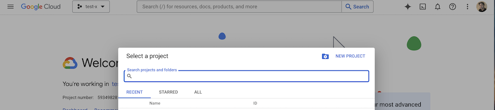
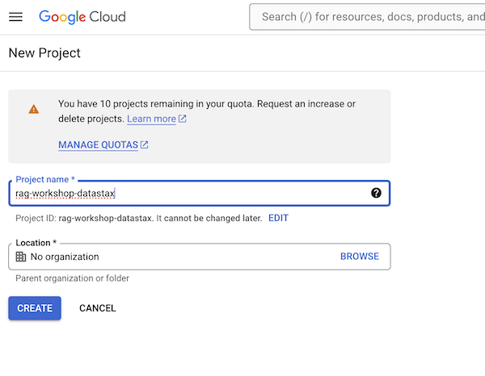
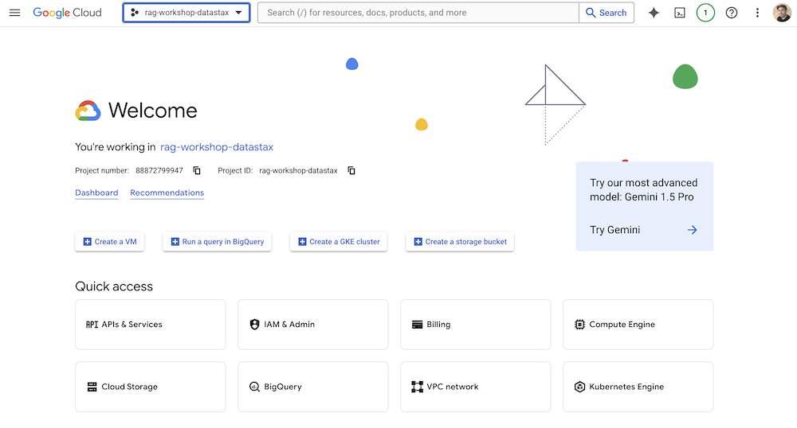
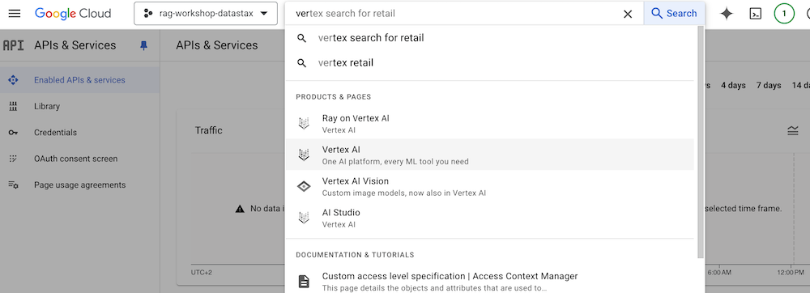
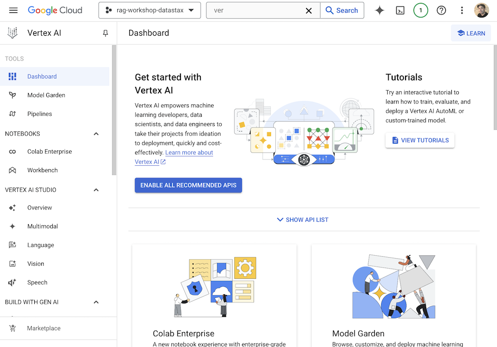
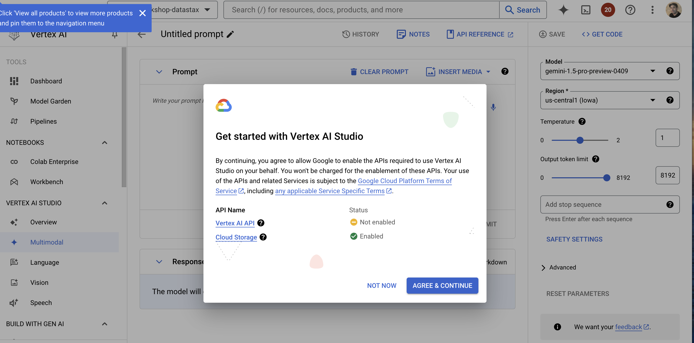
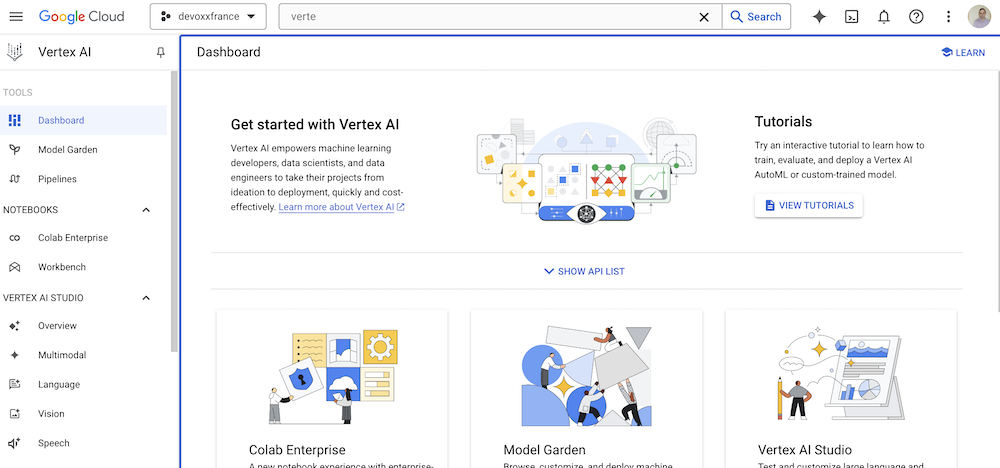
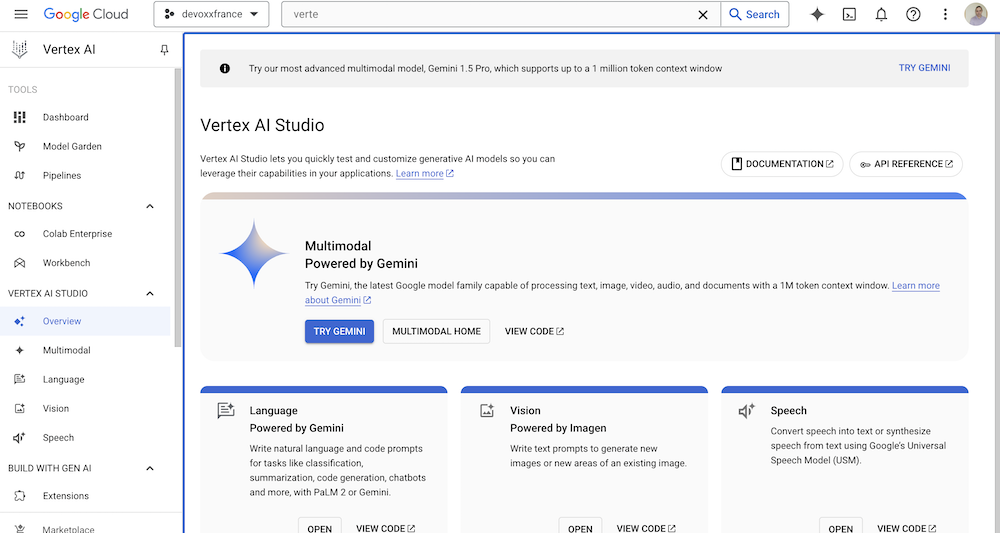
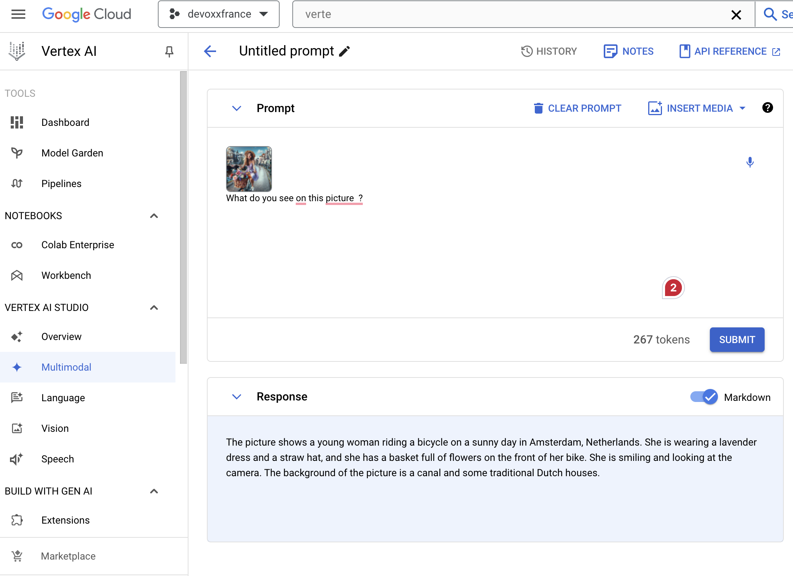

# Workshop RAG 👢Fashion Buddy 🧥 !

[](https://gitpod.io/#https://github.com/datastaxdevs/workshop-rag-fashion-buddy)
[](http://www.apache.org/licenses/LICENSE-2.0)
[](https://discord.com/widget?id=685554030159593522&theme=dark)

> ⚠️ Difficulty: **`Beginners`, we expect you to read some python code.**

Learn how to build an app end-to-end application with multi-modal retrieval augmented generation (RAG) and vector search using Astra DB, Vertex AI, and Gemini.

## 📋 Table of content

**HOUSEKEEPING**
- [Objectives](#objectives)
- [Frequently asked questions](#frequently-asked-questions)
- [Materials for the Session](#materials-for-the-session)

[**LAB1 - Environment Setup**](#)
- [1.1 - Create Astra Account](#)
- [1.2 - Create Astra Database](#)
- [1.3 - Create VertexAI account](#)
- [1.4 - Get your credentials](#)
- [1.5 - VertexAI Studio](#)

[**LAB2 - Google Collab**](#)
- [2.1 - Run Google Collab](#)
- [2.2 - Vector Search in AstraDB](#)

[**LAB3 - Streamlit application**](#)
- [3.1 - Setup your environment](#)
- [3.2 - Run the application](#)
- [3.3 - Deploy the application](#)

## HouseKeeping

### Objectives

* Discover how to use the following technologies:
    * **Google Gemini:** The latest large language model from Google
    * **Langchain** the leading framework for building application in generative AI
    * **RagStackAI** libraries provided by DataStax to ease the use of langchain
    * **GoogleCollab:** a notebook environment that runs in the cloud    
    * **StreamLit**  an easy way to build application with user interfaces in python
    * **Github workspaces:**  a full IDE in the cloud
    
    * **Astra DB** (a Database-as-a-service built on Apache Cassandra)
  
* Han fun with an interactive session

### Frequently asked questions

<p/>
<details>
<summary><b> 1️⃣ Can I run this workshop on my computer?</b></summary>
<hr>
<p>There is nothing preventing you from running the workshop on your own machine, If you do so, you will need the following
<ol>
<li><b>git</b> installed on your local system
<li><b>Python 3.8+</b> installed on your local system
</ol>
</p>
In this readme, we try to provide instructions for local development as well - but keep in mind that the main focus is development on Gitpod, hence <strong>We can't guarantee live support</strong> about local development in order to keep on track with the schedule. However, we will do our best to give you the info you need to succeed.
</details>
<p/>
<details>
<summary><b> 2️⃣ What other prerequisites are required?</b></summary>
<hr>
<ul>
<li>You will need an enough *real estate* on screen, we will ask you to open a few windows and it does not file mobiles (tablets should be OK)
<li>You will need a GitHub account eventually a google account for the Google Authentication (optional)
<li>You will need an Astra account: don't worry, we'll work through that in the following
<li>You will need a Vertex AI Account: don't worry, we'll work through that in the following
<li>You will need a Streamlit Account: don't worry, we'll work through that in the following
</ul>
</p>
</details>
<p/>
<details>
<summary><b> 3️⃣ Do I need to pay for anything for this workshop?</b></summary>
<hr>
<b>No.</b> All tools and services we provide here are FREE. FREE not only during the session but also after.
</details>

> [🏠 Back to Table of Contents](#-table-of-content)

### Materials for the Session

It doesn't matter if you join our workshop live or you prefer to work at your own pace,
we have you covered. In this repository, you'll find everything you need for this workshop:

- [Slide deck](/slides/slides.pdf)
- [Discord chat](https://dtsx.io/discord)

----


## LAB1 - Environment Setup

### 1.1 - Create Astra Account

- Access [https://astra.datastax.com](https://astra.datastax.com) and register with `Google` or `Github` account. It is free to use. There is free forever tiers of up to 25$ of consumption every month.


### 1.2 - Create Astra Database


> If you are creating a new account, you will be brought to the DB-creation form directly.

- Get to the databases dashboard (by clicking on Databases in the left-hand navigation bar, expanding it if necessary), and click the `[Create Database]` button on the right.


- **ℹ️ Fields Description**

| Field                                      | Description                                                                                                                                                                                                                                   |
|--------------------------------------------|-----------------------------------------------------------------------------------------------------------------------------------------------------------------------------------------------------------------------------------------------|
| **Vector Database vs Serverless Database** | Choose `Vector Database` In june 2023, Cassandra introduced the support of vector search to enable Generative AI use cases.                                                                                                                   |
| **Database name**                          | It does not need to be unique, is not used to initialize a connection, and is only a label (keep it between 2 and 50 characters). It is recommended to have a database for each of your applications. The free tier is limited to 5 databases. |
| **Cloud Provider**                         | Choose whatever you like. Click a cloud provider logo, pick an Area in the list and finally pick a region. We recommend choosing a region that is closest to you to reduce latency. In free tier, there is very little difference.            |
| **Cloud Region**                           | Pick region close to you available for selected cloud provider and your plan.                                                                                                                                                                 |

If all fields are filled properly, clicking the "Create Database" button will start the process.


It should take a couple of minutes for your database to become `Active`.


### 1.3. Get your credentials

To connect to your database, you need the API Endpoint and a token. The api endpoint is available on the database screen, there is a little icon to copy the URL in your clipboard. (it should look like `https://<db-id>-<db-region>.apps.astra.datastax.com`).


To get a token click the `[Generate Token]` button on the right. It will generate a token that you can copy to your clipboard.


### 1.4 - Create VertexAI account

https://console.cloud.google.com/


### 1.5 - VertexAI Studio

- Create a new project by clicking on the `Select a project` dropdown and then clicking on `New Project`



- Name your project and click on `Create`



- Make sure to select the project, then in the navigation menu, click on `Vertex AI`.





- Enable all Api for Vertex AI (make sure to have your billing account or free credit setup_)



- You should agree with the condition



- And then you should be able to access the Vertex AI Studio



- Select `Try Gemini` 



- Here we can pick a multi-modal model to use for our application



## LAB2 - Google Collab

### 2.1 - Run Google Collab 
### 2.2 - Vector Search in AstraDB


## LAB3 - Streamlit application

### 3.1 - Setup your environment
### 3.2 - Run the application
### 3.3 - Deploy the application


[](https://colab.research.google.com/drive/1_n-QZyuP898JNaX7RDnCmw9lkibgEuP-#scrollTo=RUbC-NIgkSR9)

### Credentials
* Download your service account key as a json file from Google Cloud console. Record the path to this json file. [See instructions here](https://cloud.google.com/iam/docs/keys-create-delete)
* Create a `.env` file in the same directory as `fashion_buddy.py`
* Copy/paste the following into your `.env` file and replace with your environment variables.
```
GCP_PROJECT_ID = "<YOUR_GCP_PROJECT_ID>"
ASTRA_DB_TOKEN= "AstraCS:..."
ASTRA_API_ENDPOINT= "https://<DATABASE_ID>-<REGION>.apps.astra.datastax.com"
GOOGLE_APPLICATION_CREDENTIALS_PATH= <./PATH/TO/YOUR/GOOGLE_SERVICE_ACCOUNT_KEY.json>
```


